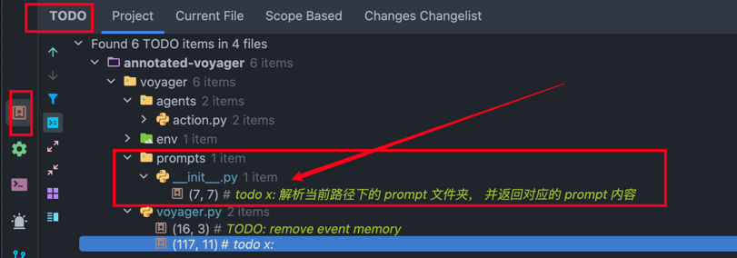

# voyager 源码分析笔记：

## 注解说明：

- ✅️ `# todo x`： 为注解标识符， 方便利用 IDE 的 TODO 工具，快速筛查注解点。

## 主要模块说明：

- ✅️ Voyager 的入口方法：`Voyager.learn()`, 由此依次展开。
- ✅️ Voyager 项目， 主要分为3部分：
    - ✅️ Python 部分： 代码在 [voyager](voyager) 目录下
    - ✅️ JS 部分： 代码在 [voyager/control_primitives](voyager/control_primitives) 目录下， 定义了一组JS脚本
    - ✅️ Nodejs 部分： 代码在 [voyager/env/mineflayer](voyager/env/mineflayer) 目录下， 启动一个 http server, 定义一组
      HTTP API.

### Python 部分核心依赖包：

1. langchain/openai/tiktoken: GPT 相关
2. javascript： 这个包比较有意思， 实现在 python 中调用 js lib。（我笔记有注解）
3. chromadb： 向量数据库，存储 task 中间步
4. minecraft_launcher_lib： minecraft 服务器登录 + 拼接 minecraft 指令

### JS 脚本：

- ✅️ voyager/control_primitives： 这目录有写了一组 minecraft bot 指令脚本

### Nodejs 服务：

- ✅️ voyager/env/mineflayer： 这里基于 `nodejs + express`, 定义了一个本地的 http server，定义的一组 HTTP API，
- ✅️ Python 代码部分，在执行 task 时， 调用的本地 HTTP API，就对应这里.

## 核心依赖库：

- ✅️ [javascript](https://pypi.org/project/javascript/)
    - https://github.com/extremeheat/JSPyBridge
    - 基于此库， 实现在 python 中调用 js lib
    - 项目依赖处： [Voyager.step](Voyager.step)

## 源码入口：

- ✅️ [voyager/voyager.py](voyager/voyager.py)

### 执行 JS 代码：

- ✅️ JS 代码位置： [control_primitives](voyager/control_primitives)
    - voyager.step() 中调用 load_control_primitives() 在 [control_primitives/__init
      __.py](voyager/control_primitives/__init__.py)

### 辅助模块：

- ✅️ [VoyagerEnv](voyager/env/bridge.py): `voyager/env/bridge.py`
- ✅️ [MinecraftInstance](voyager/env/minecraft_launcher.py): `voyager/env/minecraft_launcher.py`

#### mineflayer 本地服务(端口3000):

- ✅️ [mineflayer](voyager/env/mineflayer/index.js): `voyager/env/mineflayer/index.js`
    - 这是基于 `nodejs + express` 开发的一个 js 服务
    - 在 `voyager/env/bridge.py` 中 `get_mineflayer_process（）` 实现本地启动
    - 默认 HTTP server： `http://localhost:3000`， 端口： `3000`
- ✅️ 此模块，内部定义了一组 HTTP API：
    - `/start`: 调用此API， 启动一个 `bot`
    - `/step`: 核心功能方法， 🔥️🔥️🔥️
    - `/stop`
    - `/pause`
- ✅️ 这组 API， 也是上述 python 代码调用中，使用的。

