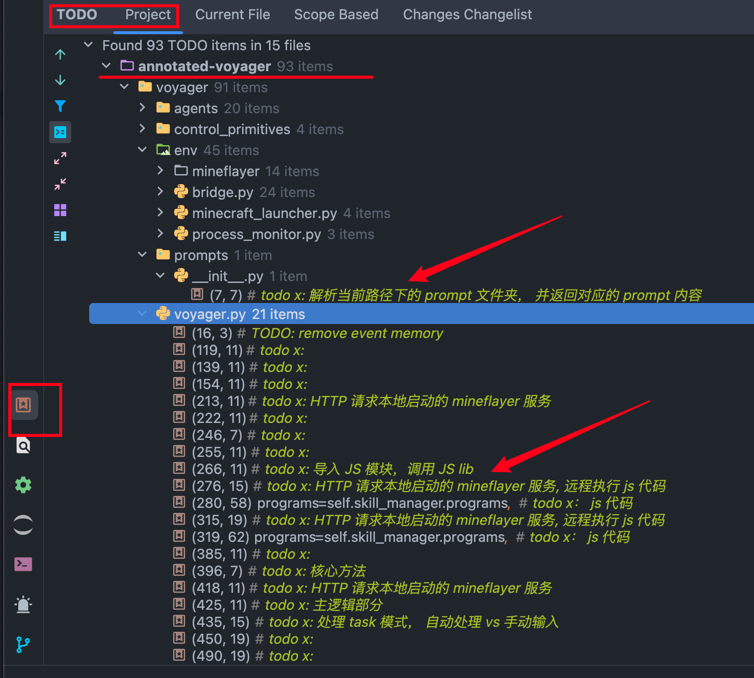

# voyager 源码分析笔记：

## 注解说明：

- ✅️ `# todo x`： 为注解标识符， 方便利用 IDE 的 TODO 工具，快速筛查注解点。

## 核心依赖库：

- ✅️ [javascript](https://pypi.org/project/javascript/)
    - https://github.com/extremeheat/JSPyBridge
    - 基于此库， 实现在 python 中调用 js lib
    - 项目依赖处： [Voyager.step](Voyager.step)

## 源码入口：

- ✅️ [voyager/voyager.py](voyager/voyager.py)

### 执行 JS 代码：

- ✅️ JS 代码位置： [control_primitives](voyager/control_primitives)
    - voyager.step() 中调用 load_control_primitives() 在 [control_primitives/__init
      __.py](voyager/control_primitives/__init__.py)

### 辅助模块：

- ✅️ [VoyagerEnv](voyager/env/bridge.py): `voyager/env/bridge.py`
- ✅️ [MinecraftInstance](voyager/env/minecraft_launcher.py): `voyager/env/minecraft_launcher.py`

#### mineflayer 本地服务(端口3000):

- ✅️ [mineflayer](voyager/env/mineflayer/index.js): `voyager/env/mineflayer/index.js`
    - 这是基于 `nodejs + express` 开发的一个 js 服务
    - 在 `voyager/env/bridge.py` 中 `get_mineflayer_process（）` 实现本地启动
    - 默认 HTTP server： `http://localhost:3000`， 端口： `3000`
- ✅️ 此模块，内部定义了一组 HTTP API：
    - `/start`: 调用此API， 启动一个 `bot`
    - `/step`: 核心功能方法， 🔥️🔥️🔥️
    - `/stop`
    - `/pause`
- ✅️ 这组 API， 也是上述 python 代码调用中，使用的。

